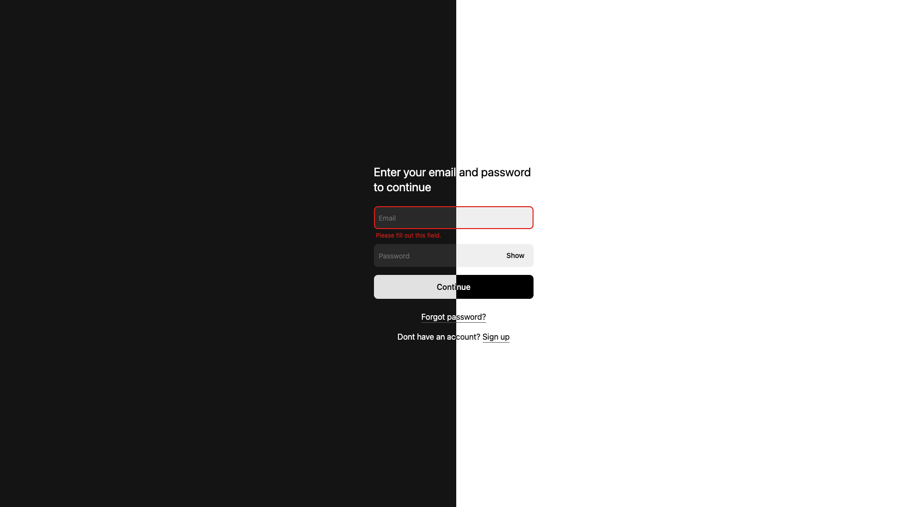

# Sign-in application
Pure Typescript/React sign-in form with hooks.




## Dev Packages

-  [Vite](https://vitejs.dev/)
-  [Swc](https://swc.rs/)
-  [LightningCss](lightningcss.dev/)

## Testing tools

-  [Vitest](vitest.dev/)
-  [Playwright](https://playwright.dev/)


## Installation

With yarn
```bash
yarn install
yarn dev
```

With npm
```bash
npm install
npm run dev
```

## Building

```bash
yarn build
npm run build
```

## Run Tests

Unit tests
```bash
yarn test
npm run test
```

E2E tests
```bash
yarn test:e2e
npm run test:e2e
```

---
Made with 🖤